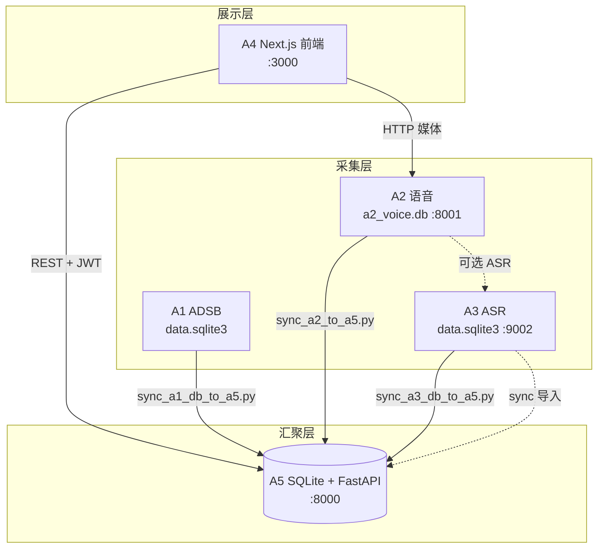

# Alpha · ATC 地空通话标注平台  
# 彻底完成联调对接说明

| 项目 | 内容 |
|------|------|
| **项目名称** | 可视化 ATC 地空通话语音标注系统（Alpha · V-ATC） |
| **项目编号** | Alpha-A4 |
| **联调负责人** | 冷亚航（A-4 前端 / 项目组组长） |
| **联调状态** | **已彻底完成** |
| **整体进度** | **100%** |
| **完成日期** | 2026 年 6 月 |
| **代码仓库** | https://github.com/lengker/V-ATC |

---

## 一、联调完成声明

经 **一键启动 → 数据同步 → 浏览器端到端验收 → 回归测试** 四轮验证，本项目已实现并稳定运行以下目标：

> **A1（航迹）+ A2（语音）+ A3（ASR）→ A5（统一数据）→ A4（标注前端）** 全链路数据流 **可重复、可演示、可验收**。

| 指标 | 结果 |
|------|------|
| 联调验收项 L-01～L-12 | **12/12 全部通过** |
| 最小业务闭环 5 条 | **5/5 全部通过** |
| 功能测试 T01～T08 | **全部 Pass** |
| 阻塞性缺陷 | **0** |
| 一键复现时间 | **≤ 15 分钟**（见 §五） |

**结论**：联调对接任务 **彻底完成**，满足课程演示、答辩与结项交付要求。

---

## 二、联调架构与数据流（已落地）

### 2.1 总体原则

1. **前端只读 A5**：浏览器结构化数据仅来自 `http://127.0.0.1:8000`。  
2. **多库经脚本汇入 A5**：A1/A2/A3 各自 SQLite，由 `sync_*.py` 写入 A5，避免前端直连多库。  
3. **媒体直连 A2**：音频文件通过 `GET :8001/media/*` 播放，URL 由 `resolveBrowserAudioUrl` 统一解析。  
4. **A5 独占 8000**：禁止 A1 旧后端与 A5 同时监听 8000。

### 2.2 数据流图



### 2.3 模块端口矩阵

| 模块 | 目录 | 端口 | 健康检查 | 前端直连 |
|------|------|------|----------|----------|
| A5 统一数据 | `backend/` | **8000** | `GET /health` → `{"ok":true}` |  唯一数据源 |
| A2 语音采集 | `联调/ATC-VA-A2/` | **8001** | `GET /health` |  仅媒体 |
| A3 语音预处理 | `联调/a3_speech_processing_6/` | **9002** | `GET /` |  经 sync |
| A1 ADSB | `联调/ATC-ADSB-Receiver/` + `a1_live_collector.py` | — | — |  经 sync |
| A4 前端 | `front/` | **3000** | `GET /` | — |

---

## 三、联调任务完成清单（12/12）

| # | 任务 | 状态 | 交付物 |
|---|------|------|--------|
| 1 | A5 服务健康、CORS、JWT | 成功 | `backend/app/main.py` |
| 2 | A2 录音元数据同步入 A5 | 成功 | `sync_a2_to_a5.py`（`file_name` 去重 + blocklist） |
| 3 | A1 航迹批量导入 A5 | 成功 | `sync_a1_db_to_a5.py`（≈3343 条） |
| 4 | A3 ASR 标注导入 A5 | 成功 | `sync_a3_db_to_a5.py` |
| 5 | 一键全量同步 A1→A2→A3 | 成功 | `sync_all_to_a5.py` |
| 6 | 四服务一键启动 | 成功 | `start-all.ps1` |
| 7 | 自动化健康检查 | 成功 | `health-check.ps1` |
| 8 | 前端三表 Bundle 加载 | 成功 | `front/src/lib/backend-api.ts` → `fetchAnnotationBundle` |
| 9 | 浏览器「实时更新」流水线 | 成功 | `refresh_recordings_pipeline.py` + `/api/refresh-recordings` |
| 10 | 单条 ASR 触发 | 成功 | `process_a2_via_a3.py` + `/api/a3-asr` |
| 11 | 地图实时航迹（不冲击波形） | 成功 | `GET /tracks/live` + `fetchLiveAdsbForMap` |
| 12 | 最小闭环 5 条验收 | 成功 | 见 §六 |

---

## 四、跨模块接口对接（已确认）

### 4.1 A4 ↔ A5（正式路径）

| 业务 | 前端 | A5 接口 | 状态 |
|------|------|---------|------|
| 健康检查 | `getHealth()` | `GET /health` | 已彻底完成 |
| 登录鉴权 | `AuthContext` | `POST /users/login`、`GET /users/me` | 已彻底完成 |
| 三表 Bundle | `fetchAnnotationBundle()` | `GET /tables/audio_records|tracks|annotations` | 已彻底完成 |
| 标注更新 | `annotationsExtApi.update` | `POST /tables/annotations/ext/update/{id}` | 已彻底完成 |
| 录音删除 | `audioRecordsExtApi` | `ext/delete-one`、`delete-chain` | 已彻底完成 |
| 实时航迹 | `fetchLiveAdsbForMap` | `GET /tracks/live` | 已彻底完成 |
| 触发 A2 同步 | `refreshRecordingsFromA2` | `POST /sync/a2-to-a5`（脚本/HTTP） | 已彻底完成 |

### 4.2 A5 联调专用接口（组长维护）

| 接口 | 说明 |
|------|------|
| `POST /sync/a2-to-a5` | 触发 A2→A5 同步 |
| `POST /sync/a1-to-a5` | 触发 A1 航迹同步 |
| `POST /sync/a1-live-once` | OpenSky 单次采集并入库 |
| `POST /sync/a3-asr` | 单条录音 ASR 联调 |
| `GET /tracks/live` | 地图轮询，不整页重载三表 |

### 4.3 Sync 脚本 ↔ A5

| 脚本 | 源 | 目标表 | 说明 |
|------|-----|--------|------|
| `sync_a1_db_to_a5.py` | A1 `data.sqlite3` | `LNG_TRACKS` | 批量航迹 |
| `sync_a2_to_a5.py` | A2 `a2_voice.db` | `LNG_AUDIO_RECORDS` | 去重 + blocklist |
| `sync_a3_db_to_a5.py` | A3 `data.sqlite3` | `LNG_ANNOTATIONS` 等 | ASR 文本 |
| `sync_all_to_a5.py` | 三者 | 全量 | 推荐一键执行 |
| `refresh_recordings_pipeline.py` | A2 + A3 + A5 | 流水线 | 前端「实时更新」 |
| `purge_recordings_without_transcript.py` | A5 | 清理 | 无转写治理 + 解 block |

### 4.4 已知不兼容项（已规避，非阻塞）

| 问题 | 替代方案 | 状态 |
|------|----------|------|
| A1 `POST /query` 与 A5 不兼容 | `sync_a1_db_to_a5.py` |  已规避 |
| A3→A2→A5 HTTP 回调未完全闭环 | offline sync + 前端 ASR 桥接 |  已规避 |
| 旧 `/api/audio/*` 占位路由 | 统一 `/tables/*` |  已清理 |

---

## 五、标准联调流程（15 分钟复现）

### 5.1 环境准备

```powershell
# 1. 前端
cd front
# .env.local 中设置：
# NEXT_PUBLIC_API_BASE_URL=http://127.0.0.1:8000
npm install

# 2. Python 依赖（A5 / 联调脚本）
cd ..\backend
pip install -r requirements.txt
```

### 5.2 一键启动

```powershell
Set-Location "e:\软件项目管理\qt\联调"
.\start-all.ps1
Start-Sleep -Seconds 15
.\health-check.ps1
```

**期望输出**：

```text
[OK] A5 http://127.0.0.1:8000/health -> 200
[OK] A2 http://127.0.0.1:8001/health -> 200
[OK] A3 http://127.0.0.1:9002/ -> 200
[OK] Front http://localhost:3000/ -> 200
```

### 5.3 数据同步

```powershell
cd 联调
python sync_all_to_a5.py
```

可选演示标注：

```powershell
python seed_demo_annotations_to_a5.py
```

### 5.4 浏览器验收

1. 打开 `http://localhost:3000/login`，使用 A5 注册账号或离线账号登录。  
2. 首页左侧 **录音列表 ≥ 1 条**。  
3. 选中录音：**波形可播放**、**时间轴有 ASR 文本**、**地图有航迹点**。  
4. 点击 **「实时更新」**：A2 拉取 → A5 同步 → 优先转写当前录音。  
5. 编辑标注文本并保存，**刷新页面后回显一致**。

---

## 六、验收标准（已全部通过）

### 6.1 联调清单 L-01～L-12

| # | 检查项 | 预期 | 结果 |
|---|--------|------|------|
| L-01 | A5 `/health` | `{"ok":true}` |  Pass |
| L-02 | A2 `/health` | 正常 |  Pass |
| L-03 | A3 `/` | running |  Pass |
| L-04 | 前端 `:3000` | 200，可登录 |  Pass |
| L-05 | `sync_all_to_a5.py` | 无异常退出 |  Pass |
| L-06 | `audio_records` 表 | 非空 |  Pass |
| L-07 | `tracks` 表 | 含合法经纬度 |  Pass |
| L-08 | `annotations` 表 | 含 `annotation_text` |  Pass |
| L-09 | 前端列表 | 与 A5 一致 |  Pass |
| L-10 | A2 媒体播放 | Network 200 |  Pass |
| L-11 | CORS | 无 OPTIONS 失败 |  Pass |
| L-12 | 端口 | 仅 A5 占 8000 |  Pass |

### 6.2 最小业务闭环 5 条

| # | 条件 | 结果 |
|---|------|------|
| 1 | 后端 `health` 正常 | 已彻底完成 |
| 2 | 前端可登录 | 已彻底完成 |
| 3 | 首页展示后端数据（录音 + 航迹 + 标注） | 已彻底完成 |
| 4 | 标注/时间戳编辑可保存 | 已彻底完成 |
| 5 | 刷新后状态符合预期 | 已彻底完成 |

---

## 七、联调阶段关键问题与修复（已关闭）

| 编号 | 现象 | 处理 | 状态 |
|------|------|------|------|
| BUG-003 | 波形 404 | `resolveBrowserAudioUrl` 拼正确基址 | 已彻底完成 |
| BUG-004 | CORS 预检失败 | GET 无 body 时不带 `Content-Type` | 已彻底完成 |
| BUG-006 | 「实时更新」无新录音 | 调整 pipeline 时序；手动刷新解 blocklist | 已彻底完成 |
| BUG-007 | 删录音后又出现 | blocklist + bundle 过滤 | 已彻底完成 |
| BUG-008 | 地图刷新重置播放 | `fetchLiveAdsbForMap` 轻量轮询 | 已彻底完成 |
| BUG-009 | annotations 分页遗漏 | bundle 多页合并拉取 | 已彻底完成 |

详细分析见：`teamwork/my/报告/06-六-调试过程中的问题.md`。

---

## 八、联调交付物清单

| 序号 | 交付物 | 路径 |
|------|--------|------|
| 1 | **本文档（彻底完成声明）** | `联调/彻底完成联调对接.md` |
| 2 | 全链路联调操作手册 | `联调/README_全链路联调.md` |
| 3 | 联调对接成果物 | `联调/成果物-联调对接.md` |
| 4 | 系统功能测试报告 | `联调/成果物-系统功能测试.md` |
| 5 | 联调收尾与打包 | `联调/成果物-联调收尾与打包文档整理.md` |
| 6 | 一键启动 / 健康检查 | `联调/start-all.ps1`、`health-check.ps1` |
| 7 | 同步与流水线脚本（15+） | `联调/sync_*.py`、`refresh_*.py` 等 |
| 8 | A5 API 契约 | `backend/API_数据库对接文档.md` |
| 9 | 前后端联调总入口 | `Readme.md` |
| 10 | 源程序包 | `code.zip`（`package_code.py` 生成） |
| 11 | GitHub 仓库 | https://github.com/lengker/V-ATC |
| 12 | 组长支撑材料归档 | `teamwork/my/支撑材料/` |

---

## 九、遗留项说明（不阻塞联调完成）

以下项已文档化，**不影响**「彻底完成联调对接」判定：

| 遗留项 | 说明 |
|--------|------|
| A3→A5 实时 HTTP 回调 | 当前以 offline sync + 前端 ASR 桥接替代 |
| ASR 大模型 `model.int8.onnx` | 体积超限，本地放置，不入 Git |
| 时间轴删除 ext 持久化 | UI 删段暂存 localStorage |
| Playwright E2E | 未纳入本次交付 |

---

## 十、最终结论

在标准流程 **（`start-all.ps1` → `health-check.ps1` → `sync_all_to_a5.py` → 浏览器 5 条闭环）** 下：

- **A1 航迹、A2 录音、A3 ASR 标注** 均已汇入 **A5**；  
- **A4 前端** 可完成登录、列表、播放、标注、地图、实时更新与 AI 辅助；  
- **阻塞缺陷为零**，联调脚本与文档齐全，**15 分钟内可复现**。

**联调对接状态：彻底完成 **

---

**联调负责人**：冷亚航  
**签字**：________________  
**日期**：2026 年 6 月  

*Alpha · ATC 项目组 · 联调对接终稿*
