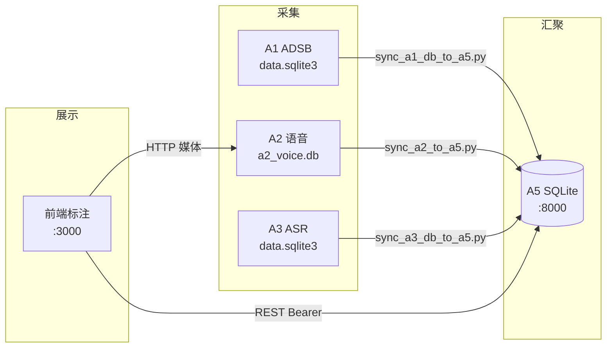

# 成果物：联调对接（任务 2）

> **项目名称**：Alpha · ATC 地空通话标注平台  
> **负责人**：A4 前端 / 项目组组长  
> **关联文档**：[`README_全链路联调.md`](README_全链路联调.md)、[`backend/API_数据库对接文档.md`](../backend/API_数据库对接文档.md) §15  
> **交付日期**：2026-05

---

## 1. 联调目标与范围

| 项 | 说明 |
|----|------|
| **目标** | 实现 A1/A2/A3 → A5 → A4 前端 **可重复、可演示** 的全链路数据流 |
| **原则** | 前端 **只读 A5**；各模块库经 sync 脚本汇入 A5，避免浏览器直连多库 |
| **不在范围** | A1 演示页实时 SQL 查询（与 A5 API 不兼容）；A3 完整 HTTP 回调闭环（可选扩展） |

### 1.1 数据流（已对接）



---

## 2. 模块端口与接口矩阵

| 模块 | 目录 | 端口 | 健康检查 URL | 前端是否直连 |
|------|------|------|--------------|--------------|
| **A5 统一数据** | `backend/` | **8000** | `GET /health` → `{"ok":true}` | ✅ 唯一结构化数据源 |
| **A2 语音采集** | `联调/ATC-VA-A2/` | **8001** | `GET /health` | ✅ 仅媒体 `GET /media/*` |
| **A3 语音预处理** | `联调/a3_speech_processing_6/` | **9002** | `GET /` | ❌（经 sync 入 A5） |
| **A1 ADSB 演示** | `联调/ATC-ADSB-Receiver/` | — | — | ❌（经 sync 入 A5） |
| **A4 前端** | `front/` | **3000** | `GET /` | — |

**冲突约定**：联调演示时 **A5 独占 8000**；禁止 A1 后端与 A5 同时监听 8000。

---

## 3. 跨模块接口对照（已确认）

### 3.1 A4 ↔ A5（正式联调路径）

| 业务 | 前端函数 | A5 接口 | 状态 |
|------|----------|---------|------|
| 健康 | `getHealth()` | `GET /health` | ✅ |
| 登录 | `loginWithBackend()` | `POST /users/login` | ✅ |
| 三表加载 | `fetchAnnotationBundle()` | `GET /tables/{audio_records,tracks,annotations}` | ✅ |
| 改标注 | `annotationsExtApi.update` | `POST /tables/annotations/ext/update/{id}` | ✅ |
| 删标注 | `annotationsExtApi.deleteOne` | `POST /tables/annotations/ext/delete-one` | ✅ |

详见 [`API_数据库对接文档.md` §15](../backend/API_数据库对接文档.md)。

### 3.2 Sync 脚本 ↔ A5

| 脚本 | 源库 | 目标表 | A5 写入方式 |
|------|------|--------|-------------|
| `sync_a1_db_to_a5.py` | A1 `data.sqlite3` | `LNG_TRACKS` | `INSERT` 批量（≈3343 条） |
| `sync_a2_to_a5.py` | A2 `a2_voice.db` | `LNG_AUDIO_RECORDS` | `POST /tables/audio_records/ext/create` |
| `sync_a3_db_to_a5.py` | A3 `data.sqlite3` | 录音 + `LNG_ANNOTATIONS` | ext/create |
| `sync_all_to_a5.py` | 上述三者 | 全量 | 顺序调用 1→2→3 |
| `seed_a1_tracks_to_a5.py` | 内置示例 | `LNG_TRACKS` | HTTP ext/create |
| `seed_demo_annotations_to_a5.py` | 内置 | `LNG_ANNOTATIONS` | 演示用秒级片段 |

**去重策略**：`sync_a2_to_a5.py` 按 `file_name` 去重，避免重复 sync 导致 A5 条数膨胀。

### 3.3 已知不兼容项（文档化，非阻塞）

| 模块 | 问题 | 联调替代方案 |
|------|------|--------------|
| A1 `adsb-receiver.js` | `POST /query` 原始 SQL，与 A5 `POST /query/arbitrary` 不兼容 | 用 `sync_a1_db_to_a5.py` 导入航迹 |
| A2 `request-processing` | 多为状态标记，A3 回调未完全闭环 | 用 `sync_a3_db_to_a5.py` 导入 ASR 结果 |
| 旧占位路由 `/api/audio/*` | A5 未实现 | 前端已改走 `/tables/*`（见 `front/docs/PR-清理api层.md`） |

---

## 4. 联调操作手册（标准流程）

### 4.1 环境准备

```powershell
# 前端
cd front
copy .env.example .env.local   # 若无则手动创建
# NEXT_PUBLIC_API_BASE_URL=http://127.0.0.1:8000
npm install
```

### 4.2 一键启动四服务

```powershell
Set-Location "e:\软件项目管理\qt\联调"
.\start-all.ps1
# 等待约 15 秒
.\health-check.ps1
```

**期望输出示例**：

```text
[OK] A5 http://127.0.0.1:8000/health -> 200
[OK] A2 http://127.0.0.1:8001/health -> 200
[OK] A3 http://127.0.0.1:9002/ -> 200
[OK] Front http://localhost:3000/ -> 200
```

### 4.3 数据同步

```powershell
cd 联调
python sync_all_to_a5.py
```

### 4.4 浏览器验收

1. 打开 `http://localhost:3000/login` 登录  
2. 首页左侧录音列表 ≥ 1 条  
3. 选中录音：波形可播、时间轴有 ASR 文本、地图有航迹点  

---

## 5. 联调验收清单

| # | 检查项 | 操作 | 预期 | 通过 |
|---|--------|------|------|------|
| L-01 | A5 存活 | `GET :8000/health` | `{"ok":true}` | ☐ |
| L-02 | A2 存活 | `GET :8001/health` | status ok | ☐ |
| L-03 | A3 存活 | `GET :9002/` | running | ☐ |
| L-04 | 前端存活 | 访问 `localhost:3000` | 200，无白屏 | ☐ |
| L-05 | 数据同步 | `sync_all_to_a5.py` | 无异常退出 | ☐ |
| L-06 | 录音入库 | `GET :8000/tables/audio_records?limit=10` | JSON 数组非空 | ☐ |
| L-07 | 航迹入库 | `GET :8000/tables/tracks?limit=5` | 含合法 lat/lon | ☐ |
| L-08 | 标注入库 | `GET :8000/tables/annotations?limit=5` | 含 `annotation_text` | ☐ |
| L-09 | 前端列表 | 登录后首页 | 列表与 A5 一致 | ☐ |
| L-10 | 媒体可达 | 播放 A2 mp3 | Network 200 | ☐ |
| L-11 | CORS | 浏览器 Console | 无 OPTIONS 失败 | ☐ |
| L-12 | 端口无冲突 | 仅 A5 占 8000 | A1 后端未并行启动 | ☐ |

---

## 6. 联调交付物清单

| 序号 | 交付物 | 路径 |
|------|--------|------|
| 1 | 全链路联调说明 | `联调/README_全链路联调.md` |
| 2 | 一键启动脚本 | `联调/start-all.ps1` |
| 3 | 健康检查脚本 | `联调/health-check.ps1` |
| 4 | 数据同步脚本（4+2） | `联调/sync_*.py`、`seed_*.py` |
| 5 | A5 接口契约 | `backend/API_数据库对接文档.md` |
| 6 | 前端接口对照 | `front/README.md`、`API_数据库对接文档.md` §15 |
| 7 | 端口与模块路径配置 | `联调/module_paths.py` |
| 8 | 本报告 | `联调/成果物-联调对接.md` |

---

## 7. 联调结论

在标准流程（启动四服务 → sync → 浏览器验收）下，**A1 航迹、A2 录音、A3 ASR 标注均可经 A5 汇聚并由 A4 前端展示**，满足课程演示与验收要求。已知 A1 实时查询、A3 完整回调为后续迭代项，不影响当前 MVP 闭环。

---

*Alpha 项目组 · 联调对接成果物*
